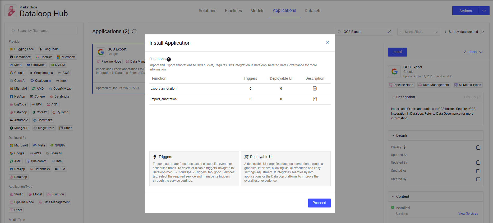
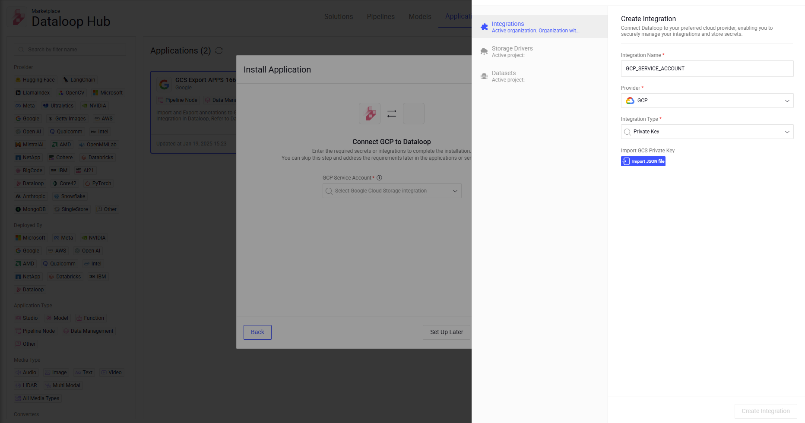
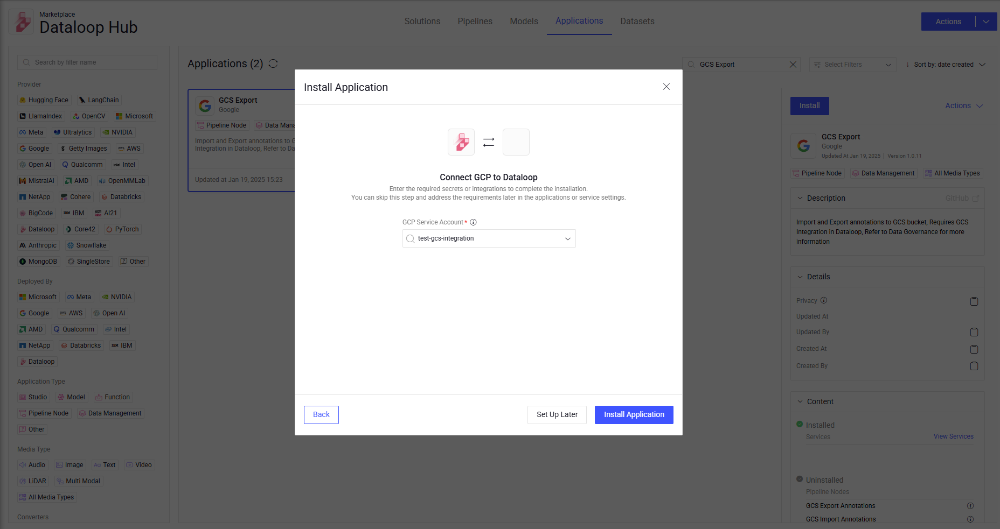

# GCS Hooks

The **GCS Hooks** application has two nodes to Export and Import annotation directly from GCS bucket.

## Quick Start:

1. Go to `Pipelines` and `Create new pipeline`.
2. Build a custom work flow that requires Export/Import annotations to/from GCS bucket
3. Define the bucket name in the node configuration panel.
4. Start pipeline

Pre-requirements: The GCS-hooks service needs an integration of `GCP_SERVICE_ACCOUNT` that holds the service account json data. 

## Node inputs and Outputs:

Both GCS-hooks nodes get the same item as input and output.

## How it works:

### Export Annotations to GCS

When an item passes through the node, the node will export the item annotations to a json file and upload it to the GCS bucket. \
The file will be uploaded to the following location: \
`<driver_path>/<item.dir>/<item.name>.json`

### Import Annotations from GCS

When an item passes through the node, the node will download the item JSON annotations file from the GCS bucket and update the item with the new annotations. \
The file will be downloaded from the following location: \
`<driver_path>/<item.dir>/<item.name>.json`

## Setting Up Your GCP Project

To use these nodes, you need a Google Cloud Platform (GCP) project. Follow these steps to get started:

1. Create a GCP [Service Account](https://docs.dataloop.ai/docs/private-key-integration#:~:text=create%20a%20project.-,Create%20a%20Service%20Account,-Log%20in%20to) 
   - Go to the IAM & Admin section in the GCP Console.
   - Create a new service account.
   - Generate a new key and download the service account JSON file.
2. Create a GCP [Bucket](https://docs.dataloop.ai/docs/private-key-integration#:~:text=the%20integration%20phase.-,Create%20a%20Cloud%20Storage%20Bucket,-Log%20in%20to)
    - Go to the Cloud Storage section in the GCP Console.
    - Create a new bucket.

## Integrating GCS Export & Import API with Dataloop Platform

- Visit the [Dataloop Marketplace](https://docs.dataloop.ai/docs/marketplace), under Applications tab.
- Select the application and click on "Install" and then "Proceed".
  
- Select an existing GCP integration or add a new one by importing the JSON file you previously downloaded.
  
- Install the application.
  

## Node Configuration:

**Configuration**

- **Node Name:** The display name on the canvas.
- **Bucket Name:** The bucket name to export/import the annotations

## Contributions, Bugs and Issues - How to Contribute

We welcome anyone to help us improve this app.  
[Here's](CONTRIBUTING.md) a detailed instructions to help you open a bug or ask for a feature request.