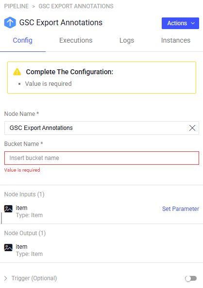

# GCS Hooks

The **GCS Hooks** application has two nodes to Export and Import annotation directly from GCS bucket.  \

## Quick Start:

1. Go to `Pipelines` and `Create new pipeline`.
2. Build a custom work flow that requires Export/Import annotations to/from GCS bucket
3. Define the bucket name in the node configuration panel. \
4. Start pipeline

Pre-requirements: The GPC-hooks service get integration_name parameter, the integration name is the secrete name that holds the service account json data.  

## Node inputs and Outputs:

Both GCS-hooks nodes get the same item as input and output

## How it works:

### Export Annotations to GCS
When an item passes through the node, will export the annotations to a json file and upload it to the GCS bucket. \
The file will be uploaded to the following location: \
`<bucket_name>/<item.dir>/<item.name>.json`

### Import Annotations from GCS
When an item passes through the node, will download the JSON annotations file from the GCS bucket and update the item with the new annotations. \
The file will be downloaded from the following location: \
`<bucket_name>/<item.dir>/<item.name>.json`

## Node Configuration TBD:

**Configuration**

- **Node Name:** Display name on the canvas.
- **Bucket Name:** the bucket name to export/import the annotations

## Contributions, Bugs and Issues - How to Contribute

We welcome anyone to help us improve this app.  
[Here's](CONTRIBUTING.md) a detailed instructions to help you open a bug or ask for a feature request.